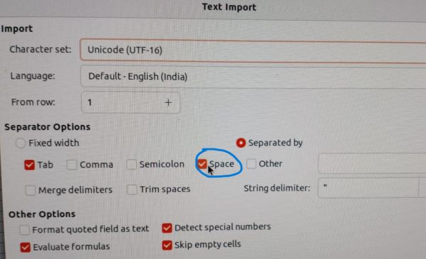
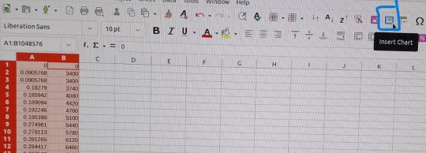
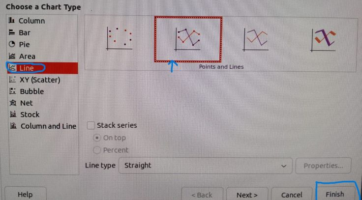

To get the <kbd> **tcp-variants-comparision.cc** </kbd> file , goto:
<kbd>**Examples** </kbd> folder in <kbd> **ns-3.39** </kbd> folder-> <kbd> **tcp** </kbd> folder-> <kbd> **tcp-variants-comparison.cc** </kbd> file.

Basefile: **tcp-variants-comparision.cc**

Final file: **final.cc**

Steps:

1. Copy the file and paste in <kbd> **scratch** </kbd> folder and rename it to <kbd> **final.cc** </kbd>

2. Do the following changes:

   In line number <ins>**345**</ins> of <kbd> **final.cc** </kbd> change "**TcpWestwoodPlus**" to " **TcpNewReno** " or " **TcpWestwoodPlus** ".

   in line <ins>**354**</ins> of <kbd> final.cc </kbd> , set <ins> **bool tracing** </ins> = <kbd> **false** </kbd> to <kbd> **true** </kbd>.

3. Then check the <kbd> **scratch** </kbd>folder again , you will find 2 new files as <kbd> TcpVariantsComparison-cwnd.data </kbd> and <kbd> **TcpVariantsComparison-rtt.data** </kbd>.

4. Use the data from those file to plot graph in xls file :

   1. Select all data from **.cc** file copy (**ctrl+a** then **ctrl+c**) and open new .xls file.
   2. Paste whole data (**ctrl+v**) to .xls file.
   3. Select <kbd> space </kbd>option in appeared window -> **ok**

   

   4. Select both Columns **A** and **B** --> click on <kbd> insert chart </kbd> icon --> <kbd>Lines</kbd> --> Choose any graph --><kbd>Finish</kbd>

   
   
